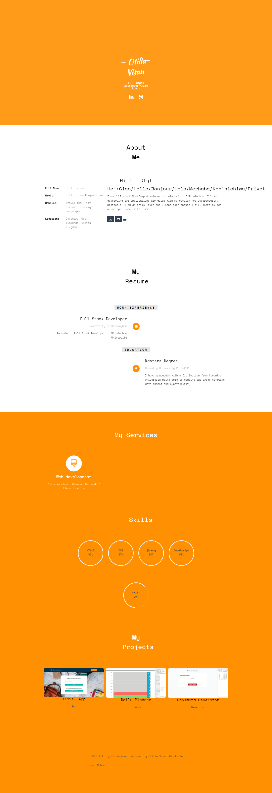
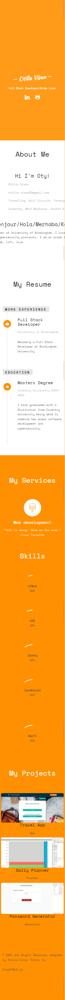
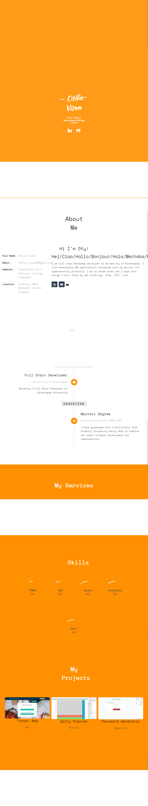

# Updated_Portofolio

## Description

Based on the

### Link to the deployed application https://otivisan22.github.io/updated_portofolio/

# Getting started

- Clone the GitHub project into your local machine
- Navigate into the project
- Open the project into VSCode
- Open the 'index.html' into your default browser

git clone git@github.com: https://github.com/otivisan22/updated_portofolio
Updated_Portofolio
code .

# What I did?

- Added a more complex title for this project
- Used Semantic HTML Elements
- Formatted code using lint (prettier)
- Formatted the CSS style according to the HTML Semantic elements
- Created the JavaScript file
- Checked if the JavaScript file is linked to the html.index
- I have used a template in order to design and update this portofolio
- The template used is from FreeHTML5.co
- I have adapted the template according to my work experience, education, my work, skills, and my projects
- For this template I have used Bootstrap, different jQueries framework based on the design of the template
- I have also used animate.css
- The icons are fully responsive and there's a third icon in the About me section which will lead the user to my CV
- The projects section will lead you to Github repo
- Formatted code using lint (prettier)
- Commented the steps that has been performed by adding comments

# Screenshots

# Testing

- A series of tests were performed and established after each change that has been done on the template
- Based on the fact that the templated needed to be adapted to my requirements, after each improvement or change the page needed to be fully responsive as you can see in the screenshots
